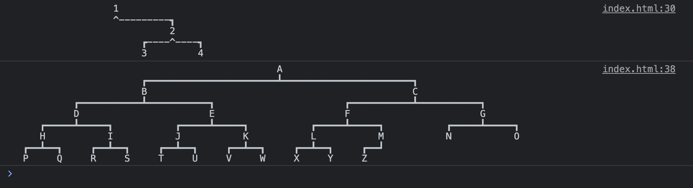
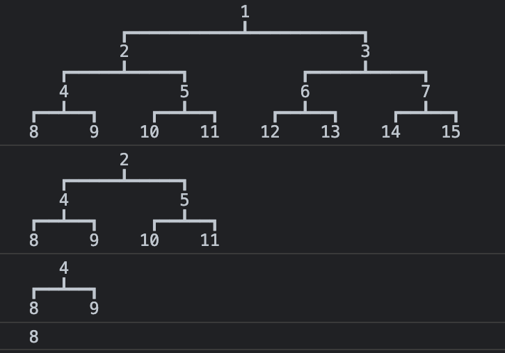

# `@n3bula/bin-tree`

### A tool used for printing a binary tree structure in a visualizing way.

## Install

```sh
npm install @n3bula/bin-tree
# or
yarn add @n3bula/bin-tree
# or
pnpm add @n3bula/bin-tree
```

## Use

### ESModule / CommonJS

```js
import BinTree from '@n3bula/bin-tree';
// const BinTree = require('@n3bula/bin-tree');

console.log(
  BinTree.print(
    {
      value: 1,
      left: null,
      right: {
        value: 2,
        left: {
          value: 3,
          left: null,
          right: null,
        },
        right: {
          value: 4,
          left: null,
          right: null,
        },
      },
    },
    {
      minLength: 5,
      marks: {
        dash: '-',
        lb: '^',
        joint: '^',
      },
    },
  ),
);
console.log(
  BinTree.print({
    value: 1,
    left: {
      value: 2,
      left: {
        value: 4,
        left: {
          value: 8,
          left: null,
          right: null,
        },
        right: {
          value: 9,
          left: null,
          right: null,
        },
      },
      right: {
        value: 5,
        left: {
          value: 10,
          left: null,
          right: null,
        },
        right: {
          value: 11,
          left: null,
          right: null,
        },
      },
    },
    right: {
      value: 3,
      left: {
        value: 6,
        left: {
          value: 12,
          left: null,
          right: null,
        },
        right: {
          value: 13,
          left: null,
          right: null,
        },
      },
      right: {
        value: 7,
        left: {
          value: 14,
          left: null,
          right: null,
        },
        right: {
          value: 15,
          left: null,
          right: null,
        },
      },
    },
  }),
);
```



```js
import BinTree from '@n3bula/bin-tree';
// const BinTree = require('@n3bula/bin-tree');

const tree = BinTree.create([1, 2, 3, 4, 5, 6, 7, 8, 9, 10, 11, 12, 13, 14, 15]);
console.log(tree);
// TreeNode {value: 1, left: TreeNode, right: TreeNode}
console.log(tree.preorderTraversal());
// [1, 2, 4, 8, 9, 5, 10, 11, 3, 6, 12, 13, 7, 14, 15]
console.log(tree.inorderTraversal());
// [8, 4, 9, 2, 10, 5, 11, 1, 12, 6, 13, 3, 14, 7, 15]
console.log(tree.left.postorderTraversal());
// [8, 9, 4, 10, 11, 5, 2]
console.log(tree.levelorderTraversal());
// [1, 2, 3, 4, 5, 6, 7, 8, 9, 10, 11, 12, 13, 14, 15]
console.log(tree.getDepth()); // 4
console.log(tree.print());
console.log(tree.left.print());
console.log(tree.left.left.print());
console.log(tree.left.left.left.print());
```



### UMD

```html
<body>
  <script src="../bin-tree/bundle.min.js"></script>
  <script>
    console.log(
      BinTree.print(
        {
          value: 1,
          left: null,
          right: {
            value: '😀',
            left: {
              value: 3,
              left: null,
              right: null,
            },
            right: {
              value: 4,
              left: null,
              right: null,
            },
          },
        },
        {
          minLength: 5,
          marks: {
            dash: '-',
            lb: '^',
            joint: '^',
          },
        },
      ),
    );
  </script>
</body>
```

## Options

| option      | value  | description                 |
| :---------- | :----- | :-------------------------- |
| minLength   | number | padding length (default: 2) |
| marks       | object | tree branches placeholder   |
| marks.dash  | string | (default: '━')              |
| marks.lt    | string | (default: '┏')              |
| marks.rt    | string | (default: '┓')              |
| marks.lb    | string | (default: '┗')              |
| marks.rb    | string | (default: '┛')              |
| marks.joint | string | (default: '┻')              |

## Author

- [Morairty47](https://github.com/Moriarty47)

## License

[The MIT License(MIT)](https://github.com/Moriarty47/n3bula/blob/main/LICENSE)

