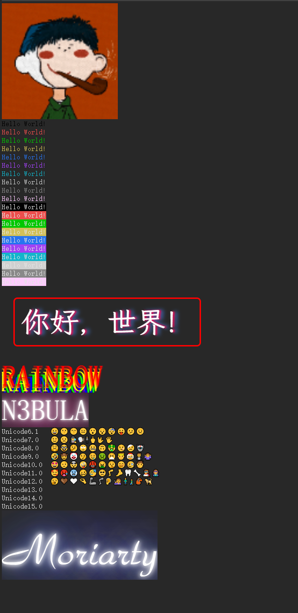

# `@n3bula/echo`

### Echo to log

## Install

```sh
npm install @n3bula/echo
# or
yarn add @n3bula/echo
# or
pnpm add @n3bula/echo
```

## Use

```ts
import { echo, sample, HEX_COLORS } from '@n3bula/echo';
echo.css(
  {
    background: 'linear-gradient(45deg, blue, red)',
    padding: '20px',
    color: 'orange',
    'font-weight': 'bolder',
    'font-size': '20px',
    border: '3px solid #ddd',
    'border-radius': '8px',
  },
  null,
  {
    background: 'linear-gradient(45deg, red, blue)',
    padding: '20px',
    color: 'orange',
    'font-weight': 'bolder',
    'font-size': '20px',
    border: '3px solid #ddd',
    'border-radius': '8px',
  },
)(echo.__TAG, echo.SPACE(30), echo.__TAG.split('').reverse().join(''));
var colors = (0, sample)(Object.keys(HEX_COLORS), 10);
for (var i = 0, len = colors.length; i < len; i += 2) {
  var j = colors[i];
  var k = colors[i + 1];
  echo.fg(j, '').bg('', k)('Hello', 'World!');
}
(0, echo)('Hello World!');
echo.fg.cadetBlue('Hello World!');
echo.fg('#1ff', 'black').bg('red', 'white')('Hello', {}, ['xxx'], 'World!');
echo.fg('purple', 'rgb(255,0,0)')('Hello World!');
echo.fg.magenta('Hello', {}, 'World!');
echo.bg.darkOrange('Hello', [], 'World!');
echo.fg('', 'hsl(350, 40, 50)').bg('', 'rgb(120, 120, 120)')('Hello', {}, 'World!');
echo.css.underline.dotted.fg.lightGreen('Dotted');
echo.css(null, {
  'text-decoration': 'underline wavy',
})('This is a', 'Wavy', 'text decoration.');
await echo.trace.css(
  {
    color: 'red',
    'text-decoration': 'underline wavy',
  },
  {
    url: './1.jpg',
    // url: 'data:imag' as const,
    height: '100px',
    border: '2px solid #fcf',
    'border-radius': '8px',
  },
  {
    color: 'cyan',
  },
  {
    color: 'orange',
  },
)(echo.__TAG, ' ', 'Hello', 'World!');
echo('😀😗😙😑😮😯😴😛😕😟\n');
echo('🙂🙁🕵🗣🕴🖕🖖🖐\n');
echo('🤗🤓🤔🙄🤐🙃🤑🤒🤕🤖\n');
echo('🤣🤠🤡🤥🤤🤢🤧🤴🤶🤵🤷\n');
echo('🤩🤨🤯🤪🤬🤮🤫🤭🧐🧒\n');
echo('🥰🥵🥶🥴🥳🥺🦵🦶🦷🦴🦸🦹\n');
echo('🥱🤎🤍🤏🦾🦿🦻🧏🧍🧎🦧🦮\n');
echo('\u{2764}\u{FE0F}\u{200D}\u{1F525}');
echo.log('Hello World!');
echo.log.fg.magenta.bg.green('Hello World!');
echo.info('Hello World!');
echo.warn('Hello World!');
// echo.warn.info('Hello World!');
echo.error('Hello World!');
echo.css({
  'font-size': '100px',
  'font-family': 'HGHT1_CNKI',
  color: 'white',
  'text-shadow':
    '0 0 7px #fff,0 0 10px #fff,0 0 21px #fff,0 0 42px #5271ff,0 0 82px #5271ff,0 0 92px #5271ff,0 0 102px #5271ff,0 0 151px #5271ff',
})('Moriarty');
echo.css({
  'font-family': '霞鹜文楷等宽',
  'font-size': '50px',
  color: 'white',
  'text-shadow': '3px 0 3px #F10D58,7px 0 7px #4578D5',
  display: 'inline-block',
  border: '3px solid red',
  'border-radius': '7px',
  padding: '10px',
  margin: '20px',
})('你好，世界！');
echo.css({
  'font-size': '50px',
  color: '#ff0000',
  'text-shadow':
    '0 2px 2px #FF0000,-2px 5px 0 #ff7f00, -4px 10px 0 #ffff00,-8px 15px 0 #00ff00,-12px 20px 0 #0000ff,-16px 25px 0 #4b0082,-20px 30px 0 #9400d3',
})('RAINBOW');
echo.css({
  'font-size': '50px',
  color: 'white',
  'text-shadow':
    '0 0 4px #fff,0 0 11px #fff,0 0 19px #fff,0 0 40px #f09,0 0 80px #f09,0 0 90px #f09,0 0 100px #f09,0 0 150px #f09',
})('N3BULA');
```



## Author

- [Moriarty47](https://github.com/Moriarty47)

## References

- [Format and style messages in the Console](https://developer.chrome.com/docs/devtools/console/format-style)
- [ANSI Color Codes](https://talyian.github.io/ansicolors/)

## License

[The MIT License(MIT)](https://github.com/Moriarty47/n3bula/blob/main/LICENSE)
